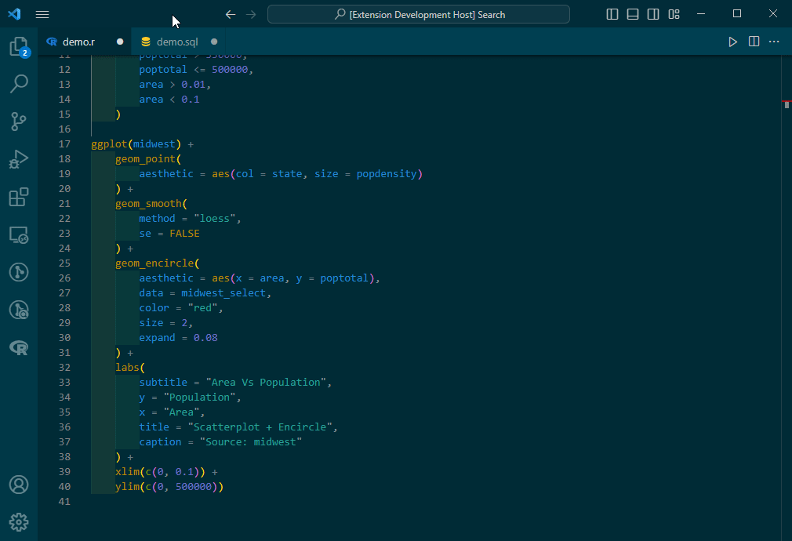

# Align text extension for Visual Studio Code

This VS Code extension allows you to align lines based on a user-provided regular expression. We pad with white space either on the left or right of a regular expression, depending whether you want to align columns or on a word.

## Align columns

Open the **Command palette** and run **Align Text: Align columns**

When run:
- Default value is `'csv'` which will use a preset regular expression to align unquoted commas.
- Other than `'csv'`, anything you type in the input box will be interpreted as regex.
- Lines are split on the right of this pattern, which are then padded with spaces to be the same length.
- If there are multiple matches on a line, we pad each to the max length of its respective column.

## Align on word

Open the **Command palette** and run **Align Text: Align on word**

When run:
- Default value to align on is `'='`. To find matches, user input is interpreted as regex and will be sandwiched with a non-word character i.e. `\W{$user_input}\W`.
- Lines are split on the left of this pattern, which are then padded with spaces to be the same length.
- Only the first match on each line is padded appropriately.
- Two presets are available:
	- For SQL data types, entering any data type e.g. `'int'` will then make a regex matching on all data types.
	- For matematical comparisons, entering any comparison will match on all: `== != >= > <= <`.

## Misalign

Open the **Command palette** and run **Align Text: Misalign selection**

When run:
- Replace all excessive whitespace with a single space, ignoring indentation.

## Keyboard shortcuts

No shortcuts are provided by default. Set them manually in **File > Preferences > Keyboard Shortcuts** (<kbd>Ctrl+K Ctrl+S</kbd>).
